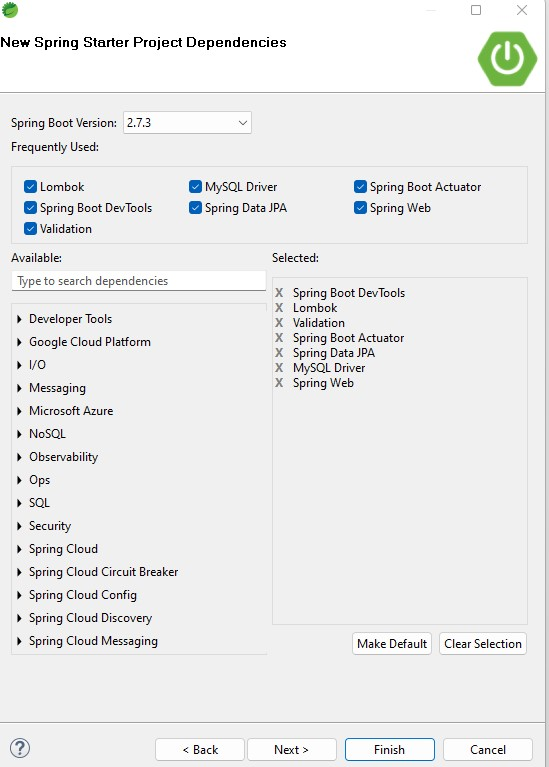

# Book-Supplier-App (BSA)

### Ayeni Abimbola 
#### QA Software Development Trainee
#### Project subimitted to QA 
#### in partial fulfilment of the requirement for the completion of the training in Software Development.

#### under the supervision of

#### Upasana Dewangan

#### August 15, 2022

## Contents  
   _Overview_ 
   _Abstract_ 
 1.   Documentation
 2.   Scope and Limitations of the Project
 3.   Aim and Objectives of the Project
 4.   Problem Definition
 5.   Significance of the Project
 6.   Deliverables
 7.   Entity Relationship Diagram (ERD) of the BSA
 8.   ERD of the BSA Area of Concentration
 9.   App Features
10.   Application Tools and Technology Used
11.   Agile & Project Management (Git, Jira)
12.   Databases & Cloud Fundamentals (MySQL Configuration)
13.   API Development (Spring Boot Project Structure)
14.   The Postman CRUD Execution
15.   Automated Testing (JUnit, Mockito)
16.   Installation
17.   Instructions for the Execution of the Project
18.   Conclusions
19.   Recommendations
20.   Future Work  
    _Acknowledgement_ 
    _Reference_ 

#
### Overview
_This app allows book suppliers to manage their books. It will allow suppliers to login and get information about request to supply book to library, schools, company and individual._ A fully fledged Spring Boot application showcasing the basic CRUD operations.
#
### Abstract
_This app was created using a **Spring Boot API**, with utilization of supporting tools, methodologies, and technologies that encapsulate an application of back-end developed using **Java** Programming Fundamentals, a managed database **(MySQL)** hosted locally on **Port 8086**, a means of making API Calls using **Postman** and a means of checking persistence using **Workbench 8.0 console**. The whole concept of this project is as detailed in **Entity Relationship Diagram (ERD)** presented here, but due to time constraints and for the purpose of fulfilling the Software Developement Training, only two entities are our focus, that is, Employee **(Supplier)** and Resources **(Book)** and there is no front end available for data input. Since, we are implementing in **Agile environment**, the project would be updated with other features in the future work._   
#
### 1.   Documentation
* Why Book Supplier App  
  The motivation for building this App stems from:
  * minimizing time spent on maintaining record of books and customer needs
  * eliminating delays in book supply to library, schools etc
  * efficiency in searching for books
  * reduction of cubersome of maintaining several documents
  * overall reduction of operating cost and time spent.
 
 * Expectation of the Project  
   There are several entities required to complete the functionality of this system with the expectation    of making it avalaible to the appropriate stakeholders within a short period of time.
 
 * What Went Well  
   * The work done showed my capability as at the time of executing this project.
   * Culmination of all the topics I have learnt as part of my training
   * The reports includes evidence of my understanding of the topics I have learnt and wider reading
   * Ability provision by qualified and experienced QA trainer, "Upasana", gave me the confidence
   * The commitment given to help by my trainer, "Upasana", is a testimony to the success of this            project.
   * Ongoing learning during the execution of the project is one of the of the things I really liked          about my project.
   * The general support of the QA via access to QA Community and Cloud Academy has given me the              opportunity to always go back to learn whenever I am stucked.
   * Also, I think what equally helped me was always asking questions in class whenever I lack                understanding of what we are doing.
   * I think I did well in my conceptual design.  I thought, it was detailed and had good information.
   * Two entities have been coded and completed and the results have somewhat successful.

 * What didn't go as Planned  
   * Inability to implement all features
   * Lauching to website
   * More depth and detail of the two entities implemented
   * Full implementation in agile framework
 
 * Improvements for Future Revisions of the Project     
   * more depth of analysis and detail for some of other entities
   * improvement on the structure of the project
   * improvement on the structure of the report
   * comprehensiveness of the tools and technology like including web security
   * Project excution in DevOps and Agile enviroments
   * More hands on coding skills
   * Researchiing more into book management systems
   
 * Screenshots showing Postman Requests and the Output from the API 
   This is as shown in section 12 of the contents 
 * Screenshots of Database to Prove that data is being Persisted 
   This is as shown in section 9 of the contents   
 * Screenshot of Test Results 
   This is as shown in section 13 of the contents 
 * Link to Jira Board 
   Although, Jira Board was not utilized, Microsoft Excell was used to produced the User Stories, the      detailed is as shown in section 8 of the conents.
 
 #
### 2. Scope and Limitations of the Project
The scope of this project at the time of submission is limted to just two functionalities.  The          development to optimize the full functionalties of this app is a continous process.   At this            stage, the most importantant limitations lies in the fact that the level of obtainable result is        far below other apps in existence because of the limited number of available features. 

#
### 3.   Aim and Objectives of the Project
The aim of this project is to develop a unique Application for suppliers to manage books through the listed objective:
*  Development in Agile environment (GitHub, Jira)
*  Database creation (MySQL)
*  coding using Java
*  API development using Spring Boot
*  Automated Testing (JUnit, Mockito)

#
### 4.   Problem Definition
  The conventional way of book management as well as the physical work required is not efficient and time consumming for both the suppliers and their customers. In the sense that the customers have to visit the suppliers directly or call on phone to ask the suppliers for books and other related information.  The suppliers on the other hand have to deal with crowds in their companies and their services are also limited. These inherent problems therefore imply a need for an automated application in a fully functional way to make the process a bit more simple and fast.

#
### 5.   Significance of the Project
* Suppliers can register themselves directly on the app 
* Suppliers can manage their books efficientlly through the app
* Suppliers will automate using proper table to maintain their record that no one can access
* Customers can register themselves directly on the app 
* Customers can access the system online and search the books that they want
* Customers can check information related to books through the app 

  #
### 6.   Deliverables
   * Codebase
     * Spring Boot API with full CRUD functionality
     * Project Structure (back-end)
   
   * Testing
     * Unit and integration testing for the project back-end
     * Test coverage of the src/main/java folder.
 
   * Continous Integration
     * GitHub Repository
     * A build of the application present in the root folder of git repo
     * A .jar which can be deployed from the command-line (java -jar <filename.jar>)
 
   * Entity Relationship Diagram (ERD)
   * Use of Custom Queries
   * Use of Custom Exceptions
   * Use of DTOs
   * Use of Lombok

 #
### 7.   Entity Relationship Diagram (ERD) of the BSA
* Conceptual ERD Drawn using Lucidchart  
  Conceptual ERD1   
  
  Conceptual ERD2   
  
* Logical ERD Drawn using Lucidchart  
  Logical ERD1   
  
Logical ERD2   
  

#
### 8.   ERD of the BSA Area of Concentration
* ERD derived from MySQL Workbence with DTO  
    
#
### 9.   App Features  
#### Book table
* **C**reate new record of book on "book table"
* **R**ead all books from "book table"
* **U**pdate book record by id on "book table"
* **D**elete record of book by id from "book table"
* Read book record by id from "book table"
* Read book record by Name from "book table"
* Read book record by Quantity from "book table"
#### Supplier Table
* **C**reate new record of supplier on "supplier table"
* **R**ead all suppliers from "supplier table"
* **U**pdate supplier record by id on "supplier table"
* **D**elete record of supplier by id from "supplier table"
* Read supplier record by id from "supplier table"
* Read supplier record by Name from "supplier table"
* Read supplier record by Phone from "supplier table"
* Login with username and password

#
### 10.   Application Tools and Technology Used
* Spring Boot (Spring Tool Suite, sts-4.15.1.RELEASE)
* JDK - 1.8
* Spring Data (Hibernatec & MySQL)
* Maven
* IDE - Eclipse
* Spring MVC (Tomcat) 
* JQuery
* MySQL 
* Wokbench 8.0 CE
* Git
* GitHub
* Postman
* Lucidchart

#
### 11.   Agile & Project Management (Git, Jira)

    
  
  Here's a link to the breakdown of the EPIC, Features and User Stories
  [GitHub]:~$ok Supplier App Product Backlog A.M. Ayeni5

#
### 12.   Databases & Cloud Fundamentals (MySQL Configuration)
* Database Configuration using MySQL  
  MySQL database was created in Worbench 8.0 with the name "booksupapp" and this was added to appication.properties under resources in sts-4.15.1.
    
  
* Book Entity Database Table from Workbench  
    
  
* Supplier Entity Database Table from Workbench  
    
  
#
### 13.   API Development (Spring Boot Project Structure)
* Spring Boot Application set up to perform CRUD Operation form sts-4.15.1.  
   
 

 

* Project Structure in Spring Boot  
    
 
* Spring war file in target  
    
 
* Spring Boot run as Maven install build success to get .war file 
    
 
* Project Structure in Spring Boot after Spring Boot was run as  Maven install to get .war file 
    
#
### 14.   The Postman CRUD Execution
#### Book table
* **Create** new record of book on "book table" using **"POST"** in Postman
    

* **Read** all books from "book table" using **"GET"** in Postman
    
 
* **Update** book record by **id** on "book table" using **"PUT"** in Postman
    
  
* **Delete** record of book by **id** from "book table" using **"DELETE"** in Postman
    
  
* **Read** book record by **id** from "book table" using **"GET"** in Postman
    
  
* **Read** book record by **Name** from "book table" using **"GET"** in Postman
    

* **Read** book record by **Quantity** from "book table" using **"GET"** in Postman
    

 
#### Supplier Table
* **Create** new record of supplier on "supplier table" using **"POST"** in Postman
    

* **Read** all suppliers from "supplier table" using **"GET"** in Postman
    

* **Update** supplier record by id on "supplier table" using **"PUT"** in Postman
    

* **Delete** record of supplier by **id = 3** from "supplier table" using **"DELETE"** in Postman
    

* **Read** all suppliers from "supplier table" using **"GET"** in Postman after deleting **id = 3** from "supplier table"
    

* **Read** supplier record by **id** from "supplier table" using **"GET"** in Postman
  

* **Read** supplier record by **Name** from "supplier table" using **"GET"** in Postman
    

* **Read** supplier record by **Phone** from "supplier table" using **"GET"** in Postman
    

* **Login** with **username** and **password** using **"GET"** in Postman
 
#
### 15.   Automated Testing (JUnit, Mockito)
* Book Service Unit Test  
    
  
* Supplier Service Unit Test  
    
  
#
### 16. Installation
The project is created with Maven, so just import into your IDE and build the project to resolve the dependencies.

#
### 17.  Instructions for the Execution of the Project
* Lombok should be installed onto sts
* Port 8086 Should free
* Project should be run as Spring Boot App through the IDE from the project explorer or run: **mvn spring-boot:run** command in the command line
* Then perform CRUD operations in Postman to check the REST endpoints using http addresses in "book Controller" and "Supplier Controller" since there is no front end for data input.

#
### 18.   Conclusions
With the successful completion of this project, the process of book and customer management by the book supplier will be simple fast. Information about books, customers and book suppliers would be automated and updated with ease.

#
### 19.   Recommendations
* In the future work, Web security should be included in the Spring Boot Application set.
* Feedback should be gotten from the user of the app for further improvement in  the future work
* Future work should include payment entity in its development

#
### 20.   Future Work 
* Provide more details of the two implemented functionalities 
* Introduce new funcionaties such as Order, Services, Support, Author, Publishers and Member.  
* Provide user-friendly CRUD and login operations via front end.

#
### _Acknowledgement_ 
Dear God! Thou art the most Rightful to be acknowledged.  I am extremely grateful to my Java trainer, Upasana Dewangan for her patience, corrections and guidance throughout the completion of this project. My sincere and heartfelt appreciation goes to my other QA learning trainers, Joshua Chesterman and Pillerina Paal for their commitments towards my learning at QA.  I have learnt a lot from the sense of responsibility of QA Client Relationship Manager, Luke Brown,  an experience for me to grow on and motivation that I cannot attempt to do less. Thank you so much for always being there. A very huge thank you to my Agile Fundamentals and Jira trainer, Himanshu Jain. I am indeed very thankful to my DevOps and Git trainer, David Tomlinson. I still remember your word David, "Do something you love and you never have to work in your life". My appreciation also goes to my Network and Security trainer, Scott Hayes.  A huge thank you to Gary Mobey, my Linux trainer.  Thank you so much Mark Fitzgerald for teaching me Databases.   To Kofi Glover, thank you very much for taking me through Python.  My gratitude also goes to David Bedford for taking me through AZ-900: Microsoft Azure Fundamentals.  To my wonderful trainer in Soft Skill, Sarah Holroyd, thank you pretty much.  To all my colleagues during the training, Feroze Khan, Ashuit Khanna, Vytautas Gruodis, Konain Buhari, Thayaanithi Rasanikanth, Marwa Dawood, Imran Tanbir, Sean Heathcote, Benjamin Pienaar, Naomi Ajagun, Gifty Aning, Ludovico, Aijamal Jusupova and others.  Thank you all for your contributions and commitments. To my precious children, thanks for your understanding.

#
 ###  _Reference_ 
  1. New Messages! (lucidchart.com)  
     https://www.lucidchart.com/pages/er-diagrams  
  2. ERD (metabase.com)  
     https://www.metabase.com/glossary/erd  
  3. What is Entity Relationship Diagram (ERD)? (visual-paradigm.com)  
     https://www.visual-paradigm.com/guide/data-modeling/what-is-entity-relationship-diagram/;WWWSESSIONID=0E27173623D3BB3B4DE53C3D5F532DFF.www1  
  4. https://www.lovelycoding.org/book-store-management-system/
  5. https://qa-community.co.uk/~/_/learning/springboot/spring--spring-setup)
  6. https://www.javatpoint.com/spring-boot-crud-operations
  7. https://github.com/Seen-Been/simple-banking-app
  8. https://github.com/vytautasdev/employee-management-app
  9. https://mvnrepository.com/artifact/org.springframework.boot/spring-boot-starter-validation/2.7.2
 10. Maven Repository: org.springframework.boot » spring-boot-starter-validation » 2.7.2 (mvnrepository.com)
  11. https://mvnrepository.com/artifact/mysql/mysql-connector-java/8.0.29
  12. Maven Repository: mysql » mysql-connector-java » 8.0.29 (mvnrepository.com)
  13. https://search.maven.org/search?q=g:junit%20AND%20a:junit
  14. Appendix A. Common application properties (spring.io)
  15. https://docs.spring.io/spring-boot/docs/1.4.x/reference/html/common-application-properties.html
Spring Initializr
  16. https://start.spring.io
  17. https://docs.spring.io/spring-framework/docs/4.1.4.RELEASE/javadoc-api/org/springframework/web/servlet/config/annotation/ContentNegotiationConfigurer.html
  18. ContentNegotiationConfigurer (Spring Framework 4.1.4.RELEASE API)
  19. https://spring.io/projects/spring-boot
  20. https://www.tutorialspoint.com/design_pattern/adapter_pattern.htm
  21. Design Patterns - Adapter Pattern (tutorialspoint.com)
  22. https://search.maven.org/artifact/org.hamcrest/hamcrest-core/1.3/jar

  ####  …there is always more to learn but then, one day at a time!   
